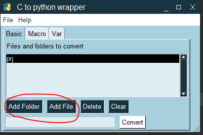
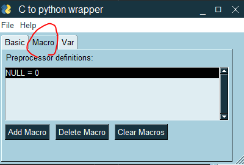
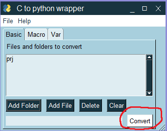

## Converting C API to python lib
This project converts C APIs to python classes, which enables programmers to use and test the C APIs in python.

The basic idea is to parse variable types, functions, and their corresponding parameters from header files, 
and rewrite them as python *ctypes* classes. 
When the number of class is tremendous, we need this tool to do it automatically.

*ctypes* is a standard python library which is used to call C codes. 
The C code is firstly compiled as a dynamic library(*.dll), and then is imported as a python class. 
Users are able to call the C functions from that class. The exported APIs are prefixed with "__declspec(dllexport)",
which can be used as an identity for parsing.

For reference,

Python Ctypes document:
https://docs.python.org/3/library/ctypes.html

This blog introduces how to use python ctypes:
https://www.cnblogs.com/night-ride-depart/p/4907613.html

### How to use
1. Run gui.py using python 3
2. add files and folders which contain the files you want to convert

   
3. For the macros or global variables that are not declared in the attached header files,
but you still want them to be defined in your result, add them in macro and var menu.

   
4. Click convert and get results in output folder

   
5. Check errors in debug.log.

  

### What this tool can do
+ Ignoring comments
+ Parsing typedef clause and getting our customized variable types
+ Parsing Array, Enum, Structure, Union
+ Parsing function pointer
+ Sorting the converted APIs and classes according to the order of calling, so that the file is executable
+ Parsing macros and replace them (* macro functions can not be parsed)
+ Parsing preprocessing clause, such as #ifdef, #if etc.
+ Parsing header files in the order that they are called in C compilers 

### Limitation 
+ **void** is not available in python. They are all regarded as **int**.
+ Redundant parenthesis may affect the parsing result, e.g. ((x)) may have a different parsing result with x
+ Unable to parse functions in C files.

### File structure
+ **output**:
    + **enum_class.py** : Conversion result of C Enumeration type
    + **structure_class.py** : Conversion result of C Structure and Union type
    + **python_API.py** : Conversion result of C functions
    + **c_arrays.py** : Conversion result of C large arrays. (Optional, turned off by default)
    + **testcase.py**: Auto-generated testcases (Optional, tur12ned off by default)
+ **parse.py** : major script for conversion
+ **gui.py** : GUI
+ **config.json** : settings stored in json file
+ **debug.log** : Recording debugging information

### Future work

+ POINTER(void) substitued as c_void_p

+ Add debugging info about which file it belongs to.

+ Add the comment of function before the API

+ \#define as a simple function, such as \#define MAX(a, b) ( (a) > (b) (a) : (b) )
   
+ C function parser. {} within {}

+ Recover file structure of the C project

### About author

email: lyihao@marvell.com

