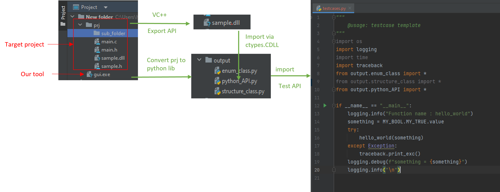
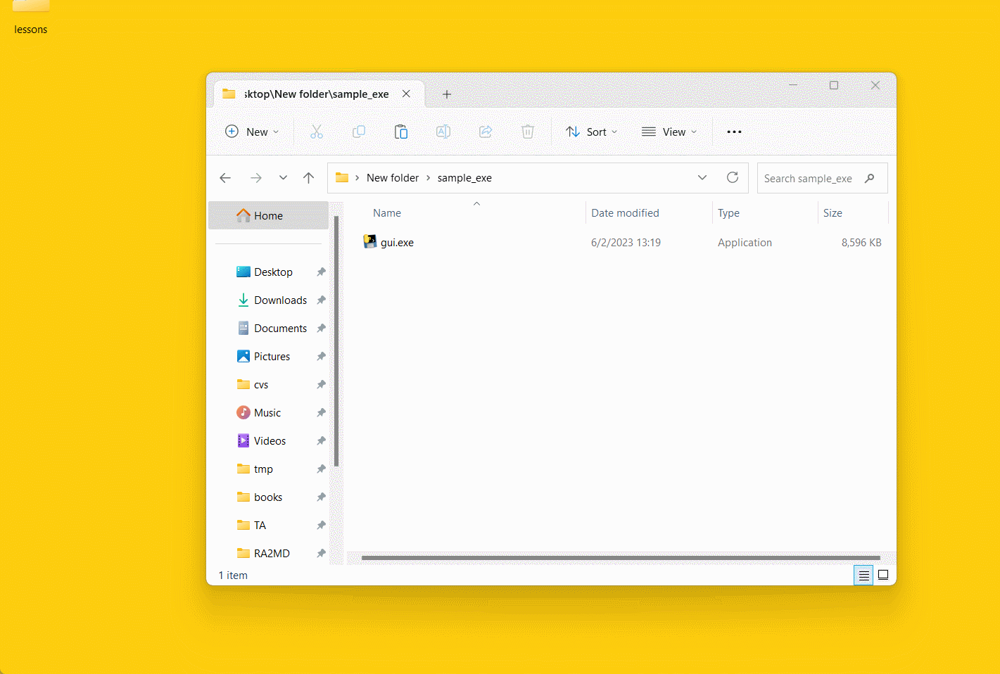
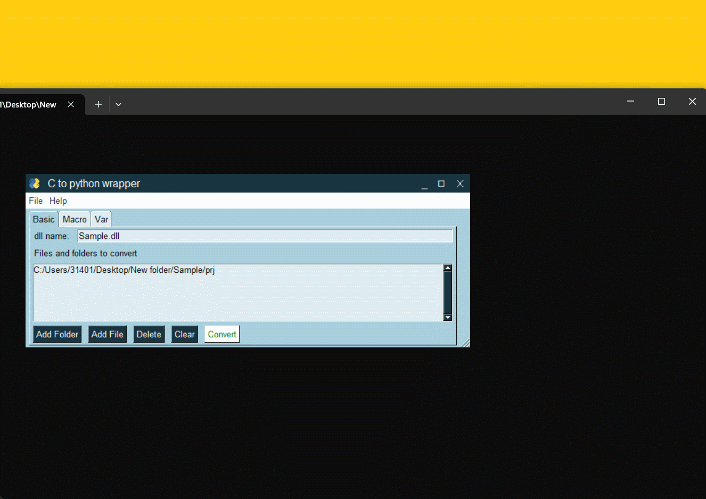
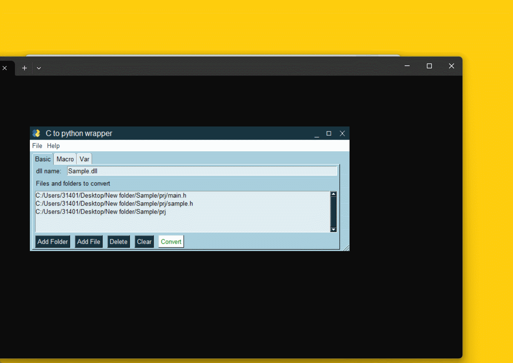
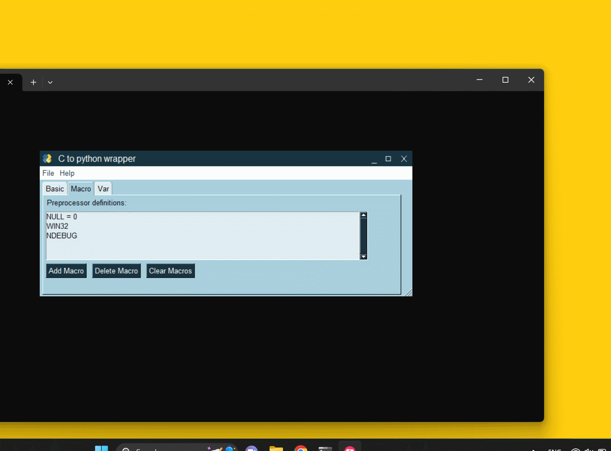
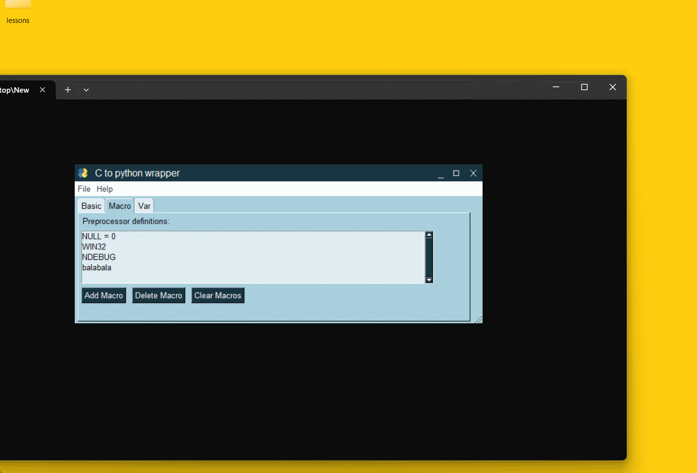
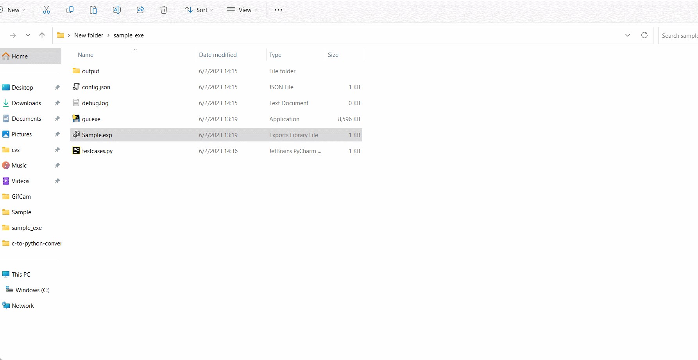

## Converting C API to python library
**This project converts C APIs to python library, which enables programmers to call and test the C APIs in python.**

The C APIs can be exported as a dynamic library(*.dll). If we want to call an API, we need to create 
a python function, which contains its parameter information, return value type, and its name. 
Meanwhile, the parameters' types and customized types(from typedef clause) are also required to be converted into python class.
This procedure is tedious and time-consuming when the amount of API is large. 
Thus, I create this tool to automatically do this job.

Below is its workflow.

### Limitation 
+ **This tool only finds and parses header files**. All the definition of APIs and variables must be declared in a header file,
and the implementation of API must be in a C file.
+ Redundant parenthesis in typedef clause will affect the parsing result, "((x))" will be regarded as a different variable from "x".
+ Function like macros are ignored, e.g. \#define MAX(a, b) ( (a) > (b) (a) : (b) ). Simple macros as below will be parsed.
  + Single definition. #define A 0x8CUL
  + Recursive calling. #define A 0\n #define C 1\n #define B  A*(2+C)
+ **void** is not available in python. They are all regarded as **int**.
+ Nested definition of structure/union is ignored. 
e.g. typedef struct
{
    union
    {
        int B;
    } Params;
} nest_structure;
Please split it into two separate structures.
+ We only regard "__declspec(dllexport)" as the prefix for APIs to export, according to VC++ document. 
If you are not operating on Windows dll, please contact author and add the prefix.
+ gui.exe is generated from python 3.9 32bit, thus it only accepts x86 dll. For x64 dll, run gui.py on 64bit python.
+ sizeof() basic c types is supported. sizeof() user-defined structure is not supported.

### Prerequisite 
+ Python version >= 3.6
+ package: PysimpleGUI

### How to use
1. Run gui.py or gui.exe
   
2. add files and folders which contain the files you want to convert

   
   
3. Some macros are predefined in visual studio IDE. You can import those definition from 
the vcxproj file of your solution. 

   
   
4. You can also manually add/delete macros.For example, add a macro called "balabala" with its value as ""(empty).
   
5. Click convert and get results in output folder. Check debug.log.Your setting will be automatically saved in config.json after conversion. The tool will load your settings when being reopened.
   
   
6. Copy your dll file to working root folder. Run your testcase, expecting "hello world".
    

### What this tool can do
+ Ignoring comments
+ Parsing typedef clause and getting our customized variable types
+ Parsing Array, Enum, Structure, Union
+ Parsing function pointer
+ Parsing macros and replace them, except for macro like functions. 
+ Parsing preprocessing clause, such as #ifdef, #if etc.
+ Parsing header files in the order that they are called in C compilers 
+ Sorting the converted APIs and classes according to the order of calling

### Future work

+ POINTER(void) substituted as c_void_p

+ Add debugging info about which file it belongs to.

+ Add the comment of function before the API

+ \#define as a simple function, such as \#define MAX(a, b) ( (a) > (b) (a) : (b) )
   
+ C function parser. {} within {}

+ Recover file structure of the C project

### About author

email: lyihao@marvell.com
